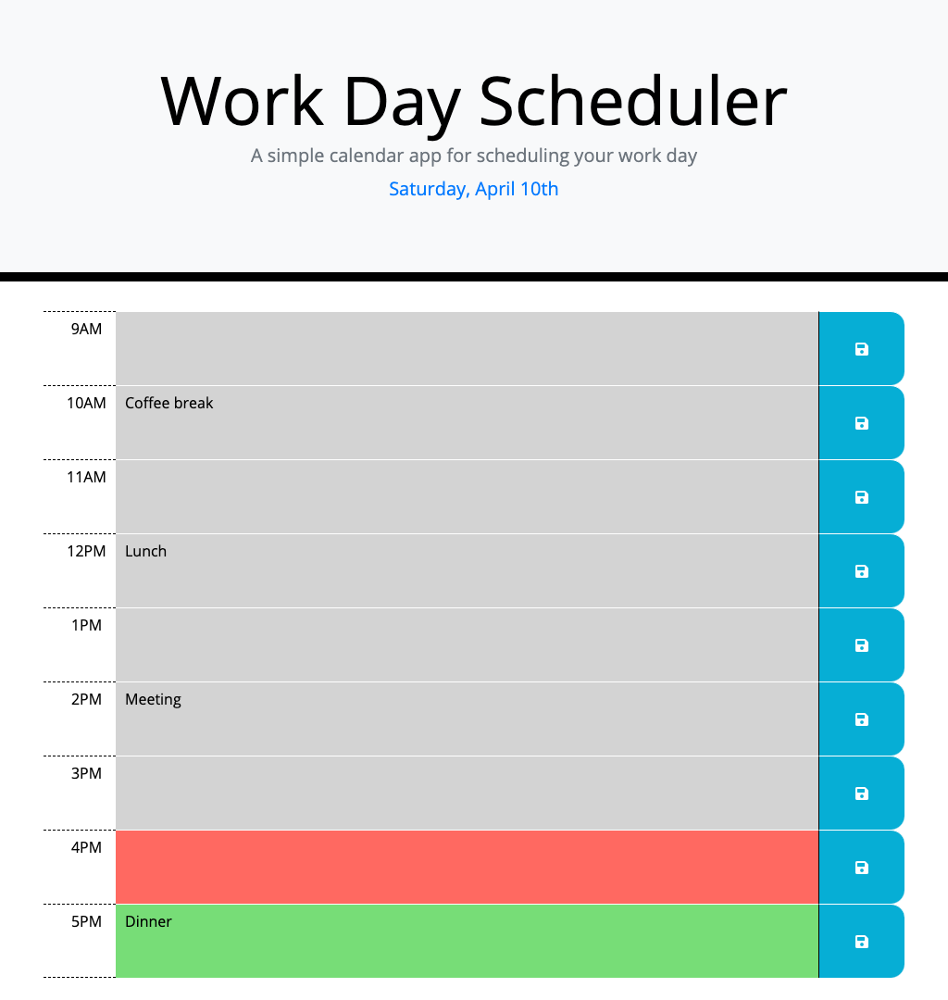

# calendar-scheduler

Project description:
Simple calendar application that allows a user to save events for each hour of the day. Uses Bootstrap, jQuery, Moment.js and Font Awesome.

Link to deployed application:
https://lindseyjeejan.github.io/calendar-scheduler/

Desktop:
 

Mobile:
 

